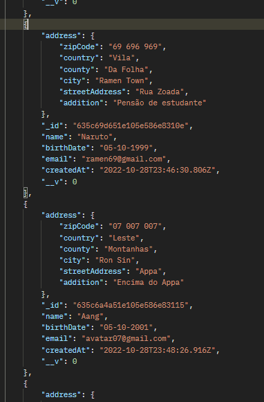
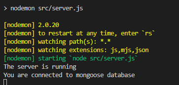

# **Backend - Registration System/Login** 

## **Description**
Back-end application to register patients

## **API Access Deploy**
[https://my-register-backend.herokuapp.com](https://my-register-backend.herokuapp.com)

## **Objectives**
- CRUD: Application that can be used to register a user, create, read, update and delete data. 

## **Technologies**

This project was developed with the following technologies: 
- JavaScript 
- Express
- Mogoose - MongoDB (Atlas)
- JSON

## **Requirements**
- Node.js;
- npm or yarn;
- Frontend: [https://github.com/malanski/development-challenge-four/tree/main/frontend/](https://github.com/malanski/development-challenge-four/tree/main/frontend)

## **Installations**
`npm install`

## **endPoints**

-POST: /patients

-GET, PATCH and DELETE: /patients/:id
  
## **Project Clone**
HTTPS  
`git clone https://github.com/malanski/development-challenge-four.git`
  
SSH  
`git clone git@github.com:malanski/development-challenge-four.git`
# 📷 App Demonstrations

  
Use Nodemon for Development:  

  
## **About the author and acknowledgment**
I Ulisses Malanski as project developer am grateful for being able to participate in this challenge, because it was a great opportunity to develop my hard skills, improving my knowledge in building web applications.

